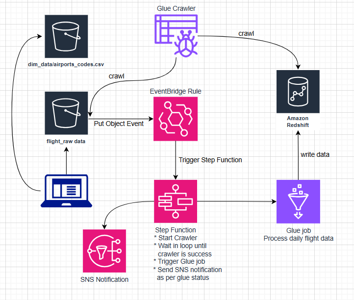

# Airlines-Data-Ingestion-Pipeline

This project implements a data ingestion pipeline for airline datasets. The pipeline automates the process of extracting, transforming, and loading (ETL) airline data from various sources into a target data store for further analysis and reporting.

## Features

- **Automated Data Extraction:** Fetches airline data from s3 bucket.
- **Data Transformation:** Cleans, validates, and transforms raw data into a consistent format.
- **Data Loading:** Loads processed data into a target database or data warehouse.
- **Logging & Error Handling:** Tracks pipeline execution and handles errors gracefully.
- **Modular Design:** Easily extendable for new data sources or transformations.

## About

This is an incremental data loading - airlines pipeline.

